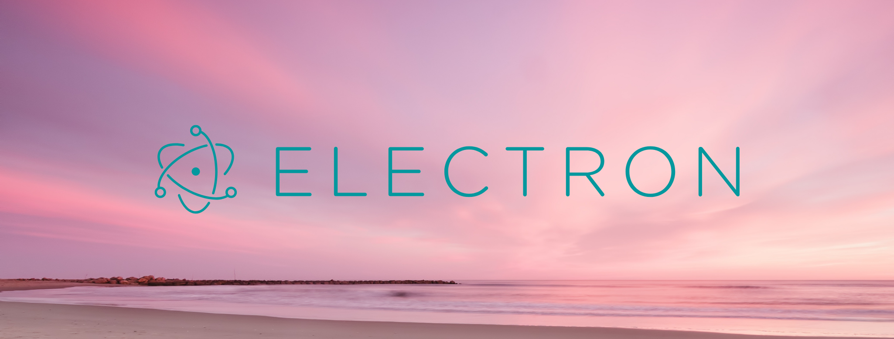

# Practical Electron

- A list of my praticing with Electron tutorials, libraries, videos and articles. 

### Electron From Scratch: Build Desktop Apps With JavaScript

- [Image Shrink App](https://github.com/duonghominhhuy/electronjs/tree/master/electron-image-shrink) 
